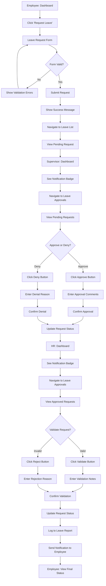
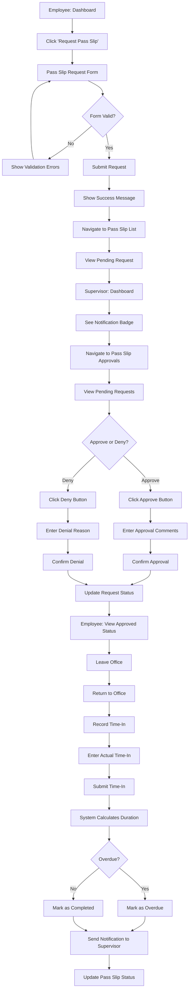
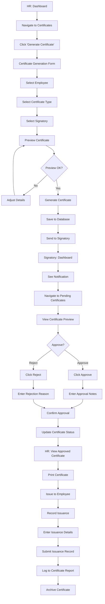

# Task Flow Diagrams
## Philippine Government HRMS Application

**Version:** 1.0  
**Date:** January 7, 2025  
**Status:** Documentation

---

## Table of Contents

1. [Introduction](#introduction)
2. [Leave Request Flow](#leave-request-flow)
3. [Pass Slip Request Flow](#pass-slip-request-flow)
4. [Certificate Generation Flow](#certificate-generation-flow)
5. [Pain Points & Optimizations](#pain-points--optimizations)

---

## Introduction

### Purpose
This document maps end-to-end task flows for key HR processes in the Philippine Government HRMS application. Each flow documents the complete user journey from initiation to completion, including all screens, decision points, and system interactions.

### Notation
- **→** Sequential step
- **◇** Decision point
- **⚠️** Pain point identified
- **✨** Optimization opportunity
- **[Role]** User role required

---

## Leave Request Flow

### Overview
**Process:** Employee requests leave → Supervisor approves → HR validates → System logs  
**Roles:** Employee, Supervisor, HR Administrator  
**Estimated Time:** 5-10 minutes (employee), 2-3 minutes (approver)

### Flow Diagram

### Screen-by-Screen Breakdown

#### Step 1: Employee Initiates Request
**Screen:** Dashboard  
**Actions:**
- View quick action card "Request Leave"
- Click card or navigate via menu

**Data Required:** None  
**Validation:** User must be authenticated

---

#### Step 2: Fill Leave Request Form
**Screen:** Leave Request Form (`/leave/request`)  
**Actions:**
- Select leave type (Vacation, Sick, Emergency, etc.)
- Select date range (start date, end date)
- Enter number of days
- Select "With Pay" or "Without Pay"
- Enter reason/justification
- Upload supporting documents (optional)
- Review leave balance
- Submit form

**Data Required:**
- Leave type
- Date range
- Number of days
- Reason

**Validation:**
- Date range must be valid (start ≤ end)
- Number of days must match date range
- Must have sufficient leave balance (if with pay)
- Reason must be provided
- No overlapping leave requests

**Pain Points:** ⚠️
- Users may not know their leave balance before starting
- Date calculation is manual
- No calendar view of team leave

**Optimizations:** ✨
- Show leave balance prominently at top of form
- Auto-calculate number of days from date range
- Add team leave calendar view
- Add HelpTooltip for leave type policies

---

#### Step 3: View Pending Request
**Screen:** Leave List (`/leave`)  
**Actions:**
- View submitted request in table
- See "Pending" status
- View request details
- Cancel request if needed

**Data Displayed:**
- Leave type
- Date range
- Number of days
- Status (Pending)
- Submitted date

**Pain Points:** ⚠️
- No real-time status updates
- Can't see who is currently reviewing

**Optimizations:** ✨
- Add real-time notification when status changes
- Show current reviewer in status column
- Add estimated approval time

---

#### Step 4: Supervisor Reviews Request
**Screen:** Leave Approvals (`/leave/approvals`)  
**Actions:**
- See notification badge on dashboard
- Navigate to approvals page
- View pending requests in table
- Click request to view details
- Review employee information
- Review leave balance
- Review reason/justification
- Approve or deny request
- Enter comments/reason
- Confirm action

**Data Displayed:**
- Employee name and ID
- Leave type
- Date range
- Number of days
- Reason
- Leave balance
- Supporting documents

**Decision Criteria:**
- Sufficient leave balance
- Valid reason
- No team conflicts
- Operational requirements

**Pain Points:** ⚠️
- Must open each request individually to review
- No batch approval for multiple requests
- Can't see team leave calendar
- No conflict detection

**Optimizations:** ✨
- Add inline approve/reject buttons in table
- Add batch approval for multiple requests
- Show team leave calendar
- Highlight conflicts automatically
- Add quick filters (by employee, by date range)

---

#### Step 5: HR Validates Request
**Screen:** Leave Approvals (`/leave/approvals`)  
**Actions:**
- See notification badge on dashboard
- Navigate to approvals page
- View approved requests in table
- Click request to view details
- Validate against policies
- Check leave credits
- Validate or reject request
- Enter validation notes
- Confirm action

**Data Displayed:**
- All employee and request information
- Supervisor approval details
- Leave policy compliance
- Leave credit calculation

**Decision Criteria:**
- Policy compliance
- Correct leave credit calculation
- Proper documentation
- Supervisor approval valid

**Pain Points:** ⚠️
- Manual policy compliance check
- No automated leave credit calculation
- Duplicate review of same information

**Optimizations:** ✨
- Add automated policy compliance checks
- Add automated leave credit calculation
- Add policy violation warnings
- Add quick validation button for compliant requests

---

#### Step 6: Employee Views Final Status
**Screen:** Leave List (`/leave`)  
**Actions:**
- Receive notification of final status
- View updated status in table
- View approval/rejection details
- View comments from approvers

**Data Displayed:**
- Final status (Approved, Denied, Validated)
- Approval chain (Supervisor → HR)
- Comments from each approver
- Updated leave balance

**Pain Points:** ⚠️
- No email notification
- Must manually check status

**Optimizations:** ✨
- Add email notification
- Add push notification
- Add notification inbox
- Show approval timeline

---

### Complete Flow Summary

**Total Steps:** 6 major steps  
**Total Screens:** 4 unique screens  
**Roles Involved:** 3 (Employee, Supervisor, HR)  
**Average Time:** 15-20 minutes total  
**Pain Points Identified:** 10  
**Optimization Opportunities:** 13

---

## Pass Slip Request Flow

### Overview
**Process:** Employee requests pass slip → Supervisor approves → Employee records time-in → System completes  
**Roles:** Employee, Supervisor  
**Estimated Time:** 3-5 minutes (employee), 1-2 minutes (approver)

### Flow Diagram

### Screen-by-Screen Breakdown

#### Step 1: Employee Initiates Request
**Screen:** Dashboard  
**Actions:**
- View quick action card "Request Pass Slip"
- Click card or navigate via menu

**Data Required:** None  
**Validation:** User must be authenticated

---

#### Step 2: Fill Pass Slip Request Form
**Screen:** Pass Slip Request Form (`/pass-slips/request`)  
**Actions:**
- Select pass slip type (Official Business, Personal, Medical)
- Enter destination
- Enter purpose/reason
- Select expected time out
- Select expected time in
- Calculate expected duration
- Submit form

**Data Required:**
- Pass slip type
- Destination
- Purpose
- Expected time out
- Expected time in

**Validation:**
- All fields required
- Time in must be after time out
- Duration must be reasonable (< 8 hours)
- Purpose must be provided

**Pain Points:** ⚠️
- Manual time calculation
- No validation against work schedule
- No reminder to record time-in

**Optimizations:** ✨
- Auto-calculate duration from time range
- Validate against work schedule
- Add calendar integration
- Add HelpTooltip for pass slip types
- Add reminder notification for time-in recording

---

#### Step 3: Supervisor Reviews Request
**Screen:** Pass Slip Approvals (`/pass-slips/approvals`)  
**Actions:**
- See notification badge on dashboard
- Navigate to approvals page
- View pending requests in table
- Review request details
- Approve or deny request
- Enter comments
- Confirm action

**Data Displayed:**
- Employee name and ID
- Pass slip type
- Destination
- Purpose
- Expected time out/in
- Expected duration

**Decision Criteria:**
- Valid reason
- Operational requirements
- Employee availability

**Pain Points:** ⚠️
- Must open each request individually
- No batch approval
- No conflict detection

**Optimizations:** ✨
- Add inline approve/reject buttons
- Add batch approval
- Show employee schedule
- Highlight conflicts

---

#### Step 4: Employee Records Time-In
**Screen:** Pass Slip List (`/pass-slips`)  
**Actions:**
- Return to office
- Navigate to pass slip list
- Find approved pass slip
- Click "Record Return" button
- Enter actual time in
- Submit time-in
- View completed status

**Data Required:**
- Actual time in

**Validation:**
- Time in must be after time out
- Time in must be today or past

**Pain Points:** ⚠️
- Easy to forget to record time-in
- No mobile-friendly interface
- No QR code or quick access

**Optimizations:** ✨
- Add push notification reminder
- Add mobile-optimized interface
- Add QR code for quick access
- Add automatic time-in (GPS-based, future)

---

### Complete Flow Summary

**Total Steps:** 4 major steps  
**Total Screens:** 3 unique screens  
**Roles Involved:** 2 (Employee, Supervisor)  
**Average Time:** 8-12 minutes total  
**Pain Points Identified:** 7  
**Optimization Opportunities:** 10

---

## Certificate Generation Flow

### Overview
**Process:** HR generates certificate → Signatory approves → HR issues certificate → System logs  
**Roles:** HR Administrator, Signatory (Department Head/HR Director)  
**Estimated Time:** 5-10 minutes (HR), 2-3 minutes (signatory)

### Flow Diagram

### Screen-by-Screen Breakdown

#### Step 1: HR Initiates Certificate Generation
**Screen:** Certificate Generate (`/admin/certificates/generate`)  
**Actions:**
- Navigate to certificates module
- Click "Generate Certificate"
- Select employee from autocomplete
- Select certificate type from dropdown
- Select signatory (optional)
- Preview certificate
- Adjust details if needed
- Generate certificate

**Data Required:**
- Employee ID
- Certificate type
- Signatory (optional)

**Validation:**
- Employee must exist
- Certificate type must be selected
- Employee data must be complete

**Pain Points:** ⚠️
- Manual employee search
- No validation of employee eligibility
- No template preview before selection

**Optimizations:** ✨
- Add employee eligibility check
- Add template preview gallery
- Add recent employees list
- Add batch generation for multiple employees
- Add HelpTooltip for certificate types

---

#### Step 2: Signatory Reviews Certificate
**Screen:** Certificate Approvals (future feature)  
**Actions:**
- Receive notification
- Navigate to pending certificates
- View certificate preview
- Review employee information
- Approve or reject certificate
- Enter notes
- Confirm action

**Data Displayed:**
- Employee information
- Certificate type
- Certificate content
- Generated by (HR user)
- Generation date

**Decision Criteria:**
- Information accuracy
- Employee eligibility
- Proper formatting

**Pain Points:** ⚠️
- No dedicated approval workflow (currently manual)
- No notification system
- No audit trail

**Optimizations:** ✨
- Add dedicated approval workflow
- Add notification system
- Add digital signature integration
- Add approval audit trail

---

#### Step 3: HR Issues Certificate
**Screen:** Certificate Log (`/admin/certificates/log`)  
**Actions:**
- View approved certificates
- Print certificate
- Issue to employee
- Record issuance
- Enter issuance details (date, recipient, purpose)
- Submit issuance record
- Archive certificate

**Data Required:**
- Issuance date
- Recipient name
- Purpose

**Validation:**
- Certificate must be approved
- Issuance date must be valid

**Pain Points:** ⚠️
- Manual issuance recording
- No employee signature capture
- No digital certificate option

**Optimizations:** ✨
- Add employee signature capture
- Add digital certificate generation (PDF with QR code)
- Add email delivery option
- Add automatic issuance recording

---

### Complete Flow Summary

**Total Steps:** 3 major steps  
**Total Screens:** 3 unique screens  
**Roles Involved:** 2 (HR Administrator, Signatory)  
**Average Time:** 12-18 minutes total  
**Pain Points Identified:** 8  
**Optimization Opportunities:** 11

---

## Pain Points & Optimizations

### Summary of Pain Points

**Total Pain Points Identified:** 25

**By Category:**
- **Usability:** 10 pain points
  - Manual calculations
  - No batch operations
  - Must open items individually
  - No real-time updates
  
- **Efficiency:** 8 pain points
  - Duplicate reviews
  - Manual data entry
  - No automation
  - Slow approval process
  
- **Visibility:** 7 pain points
  - No notifications
  - No status tracking
  - No conflict detection
  - No team visibility

### Summary of Optimizations

**Total Optimization Opportunities:** 34

**By Priority:**

**P0 (Critical) - 8 optimizations:**
- Add inline approve/reject buttons
- Add real-time notifications
- Add HelpTooltip components
- Add automated calculations
- Add policy compliance checks
- Add conflict detection
- Add batch approval
- Add notification system

**P1 (High) - 14 optimizations:**
- Add team leave calendar
- Add quick filters
- Add approval timeline
- Add mobile optimization
- Add email notifications
- Add digital signatures
- Add employee signature capture
- Add audit trail
- Show leave balance prominently
- Show current reviewer
- Highlight conflicts
- Add policy violation warnings
- Add reminder notifications
- Add QR code access

**P2 (Medium) - 12 optimizations:**
- Add calendar integration
- Add GPS-based time-in
- Add digital certificate generation
- Add email delivery
- Add automatic issuance recording
- Add template preview gallery
- Add recent employees list
- Add batch generation
- Add estimated approval time
- Add approval chain visualization
- Add employee schedule view
- Add conflict resolution suggestions

### Implementation Recommendations

**Phase 1 (Weeks 1-4):**
- Implement inline approval actions
- Add notification system
- Add HelpTooltip components
- Add automated calculations

**Phase 2 (Weeks 5-8):**
- Add batch approval
- Add team calendar views
- Add conflict detection
- Add policy compliance checks

**Phase 3 (Weeks 9-12):**
- Add mobile optimizations
- Add email notifications
- Add digital signatures
- Add audit trail enhancements

---

**Document End**

*This document should be updated as new pain points are identified and optimizations are implemented.*

